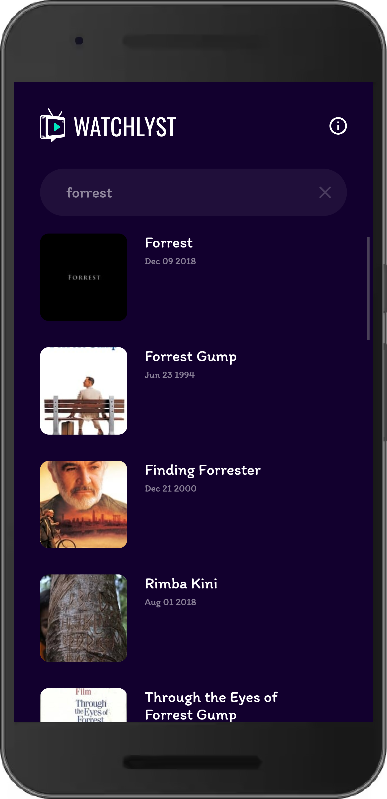

<a name="readme-top"></a>

<div align="center">
  <a href="https://github.com/j3rech0/watchlyst/">
    
  </a>
  <h1 align="center">WATCHLYST</h1>
  <h4 align="center">Watch movie online, movie streaming app.</h4>
</div>
<br />
<br />
<!-- ABOUT THE PROJECT -->

## About The Project

Using TMDB API, WATCHLYST is a React Native app with a Home screen featuring Trending, Popular, and Top rated categories, search, Movie details, and About sections.
<br />
<br />
<details>
	<summary>View screenshots</summary>
<p align="center">
  <br /><br />
  <br /><br />
  <br /><br />
  
</p>
</details>
<br />

### Built With

- [Expo](https://expo.dev/)
- [React Native](https://reactnative.dev/)
- [styled-components](https://styled-components.com/)

<!-- GETTING STARTED -->
<br />

## Getting Started

### Prerequisites

- [Node.js](https://nodejs.org/en/download/)
- [TMDB Api](https://api.themoviedb.org/3/)

<br />

### Installation
<br />

Clone this repo and enter project
   ```sh
   git clone https://github.com/j3rech0/watchlyst.git
   cd watchlyst/
   ```
<br />

Install NPM packages
<br />
   ```sh
   yarn
   ```
<br />

Get your API Key at [https://www.themoviedb.org/](https://www.themoviedb.org/)
<br />

Rename `.env.example` to `.env`:
   ```
    API_URL = "https://api.themoviedb.org/3/"
    API_KEY = "YOUR_API_KEY"
    MOVIE_URL = "https://www.2embed.to/embed/tmdb/"
    IMAGE_URL = "https://image.tmdb.org/"
    SEGMENT_KEY = "SEGMENT_KEY"
   ```
Run app
   ```sh
   yarn start
   ```


## Author

[Jech](https://jerecho.com/)

